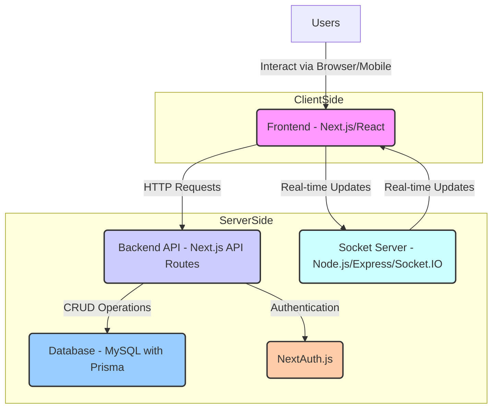
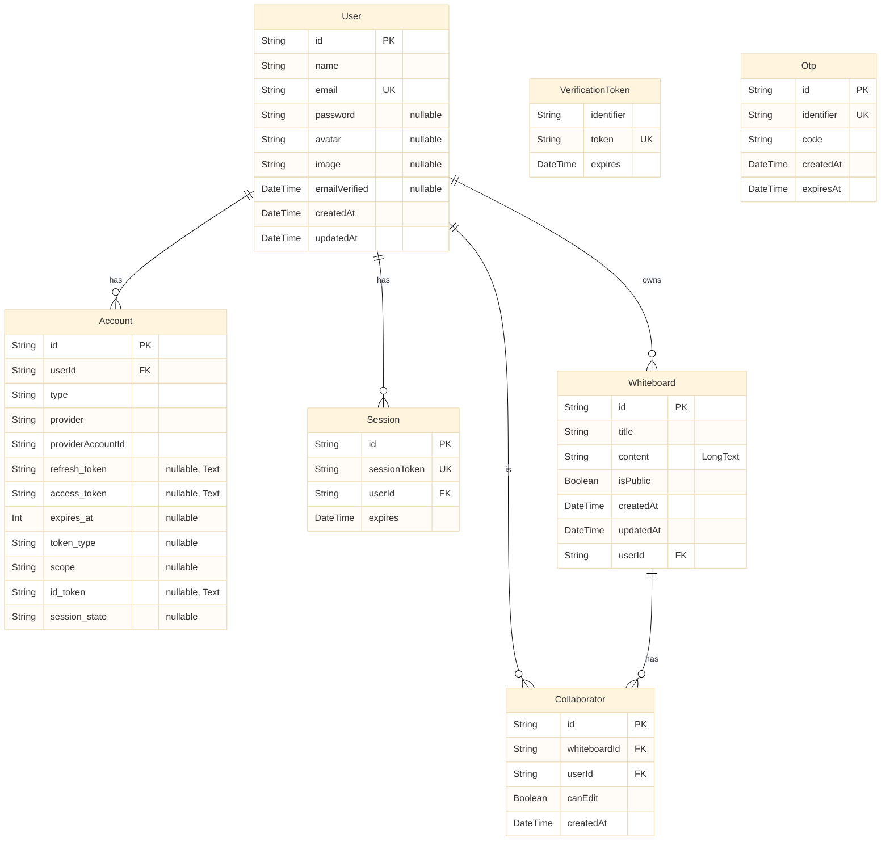
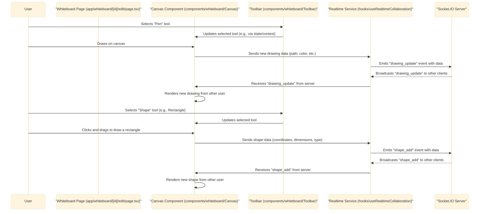
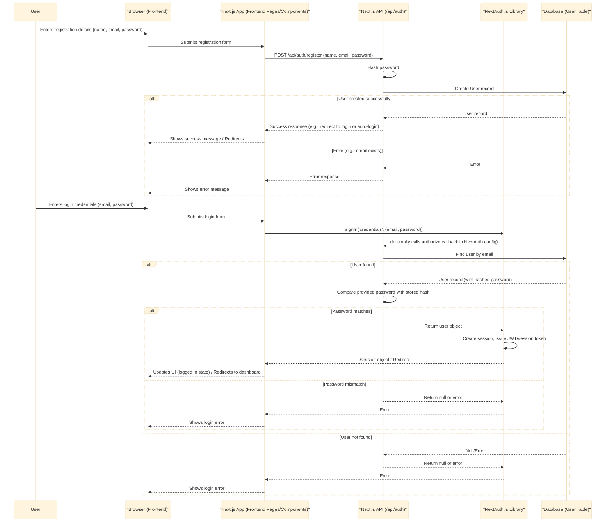
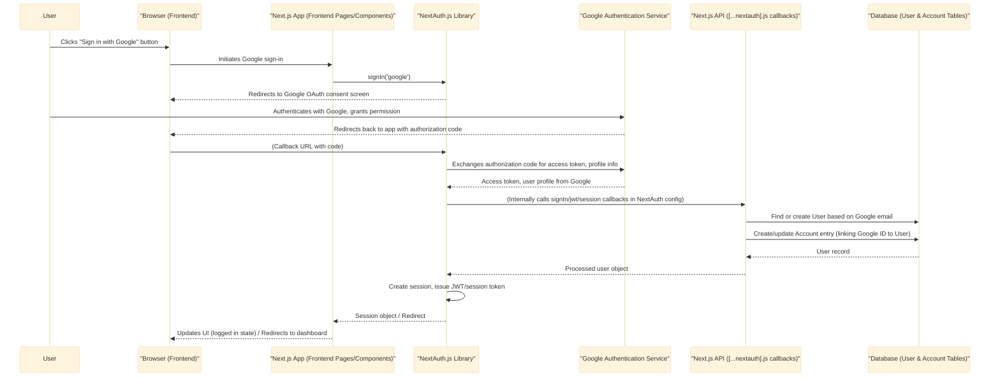

# CanvaSync - Real-time Collaborative Whiteboard Application

CanvaSync is a powerful, real-time collaborative whiteboard application that enables teams to create, share, and collaborate on digital whiteboards from anywhere in the world. With an infinite canvas, intuitive drawing tools, and seamless real-time collaboration, CanvaSync transforms how teams brainstorm, plan, and visualize ideas together.

**Live Demo:** [https://canvasync.vercel.app/](https://canvasync.vercel.app/)


## 🌟 Features

### Infinite Canvas

- Unlimited space to express your ideas without constraints
- Zoom and pan functionality for easy navigation
- Grid and snap-to-grid options for precise layouts

### Real-time Collaboration

- Multiple users can edit simultaneously
- See other users' cursors and changes in real-time
- Join and leave notifications for collaborators
- User presence indicators show who's currently viewing the whiteboard

### Rich Drawing Tools

- Pen, brush, and highlighter tools with customizable colors and sizes
- Shape tools including rectangles, circles, diamonds, and arrows
- Text tool with formatting options
- Selection and transformation tools for easy editing
- Stroke style options (solid, dashed, dotted)
- Fill options (transparent or solid with opacity control)

### Smart Features

- Keyboard shortcuts for power users
- Undo/redo functionality
- Copy, cut, and paste operations
- Export to PDF and image formats

### Mobile Optimized

- Fully responsive design works on all devices
- Touch-specific features for mobile users:
  - Two-finger pan to navigate
  - Pinch to zoom
  - Long press for context menus
  - Area selection with touch gestures
  - Mobile-specific UI adaptations

### User Management

- User authentication and authorization (including email/password and Google OAuth)
- Profile management with avatars
- Whiteboard sharing with customizable permissions

### Cloud Storage

- Automatic saving of whiteboards
- Access your whiteboards from any device
- Share whiteboards via links with customizable permissions

## 🚀 Getting Started

### Prerequisites

- Node.js (v18 or higher)
- npm or yarn
- MySQL database

### Installation

1. Clone the repository:

```bash
git clone https://github.com/ItsRudaksh/canvasync.git
cd canvasync
```

2. Install dependencies:

```bash
npm install
```

3. Set up environment variables (For both root and server directory):

```bash
cp .env.example .env
```

Edit the `.env` file with your database and other configuration details.

4. Set up the database:

```bash
npx prisma migrate dev
```

5. Start the development server:

```bash
npm run dev
```

6. Start the socket server (in a separate terminal):

```bash
npm run socket
```

7. Open your browser and navigate to `http://localhost:3000`

## 🏗️ Architecture

CanvaSync is built with a modern tech stack:

- **Frontend**: Next.js, React, TypeScript, Tailwind CSS, Framer Motion
- **UI Libraries**:
  - [Shadcn UI](https://ui.shadcn.com/) - A collection of reusable components built with Radix UI and Tailwind CSS
  - [Aceternity UI](https://ui.aceternity.com/) - Modern UI components with beautiful animations and effects
- **Backend**: Node.js, Express, Socket.IO
- **Database**: MySQL with Prisma ORM
- **Authentication**: NextAuth.js (supports email/password and Google OAuth)
- **Real-time Communication**: Socket.IO

### Key Components

- **Whiteboard Editor**: The core canvas component that handles drawing, selection, and user interactions
- **Socket Server**: Manages real-time communication between users
- **Prisma Schema**: Defines the data model for users, whiteboards, and collaborators

### Deployment

- **Frontend**: Deployed on [Vercel](https://www.vercel.com/) at [https://canvasync.vercel.app/](https://canvasync.vercel.app/)
- **Socket Server**: Deployed on [Railway](https://railway.app/) for reliable real-time communication

## 🔧 Development

### Project Structure

```
canvasync/
├── app/                  # Next.js app directory
│   ├── api/              # API routes
│   ├── auth/             # Authentication pages
│   ├── dashboard/        # Dashboard pages
│   ├── whiteboard/       # Whiteboard pages
│   └── page.tsx          # Landing page
├── components/           # React components
│   ├── aceternity/       # Aceternity UI components
│   ├── auth/             # Authentication components
│   ├── dashboard/        # Dashboard components
│   ├── ui/               # Shadcn UI components
│   └── whiteboard/       # Whiteboard components
├── hooks/                # Custom React hooks
├── lib/                  # Utility functions
├── prisma/               # Prisma schema and migrations
├── public/               # Static assets
├── server/               # Socket.IO server
└── styles/               # Global styles
```

### Commands

- `npm run dev`: Start the Next.js development server
- `npm run build`: Build the application for production
- `npm run start`: Start the production server
- `npm run socket`: Start the Socket.IO server
- `npm run lint`: Run ESLint
- `npm run deploy`: Generate Prisma client and build the application

## 📝 License

This project is licensed under the MIT License - see the LICENSE file for details.

## 🙏 Acknowledgements

- [Next.js](https://nextjs.org/)
- [React](https://reactjs.org/)
- [Socket.IO](https://socket.io/)
- [Prisma](https://www.prisma.io/)
- [Tailwind CSS](https://tailwindcss.com/)
- [Framer Motion](https://www.framer.com/motion/)
- [Radix UI](https://www.radix-ui.com/)
- [Shadcn UI](https://ui.shadcn.com/)
- [Aceternity UI](https://ui.aceternity.com/)
- [Lucide Icons](https://lucide.dev/)
- [Railway](https://railway.app/)

## Architecture Diagram



## Database Schema



## Component Interaction: Real-time Whiteboard Editing



## API Endpoint Structure

```mermaid
%%{init: {'theme': 'base', 'themeVariables': { 'fontSize': '16px'}}}%%
graph TD
    A(API Root: /api) --> Auth[auth]
    A --> Profile[profile]
    A --> Users[users]
    A --> Whiteboards[whiteboards]

    subgraph "Authentication Endpoints (/api/auth)"
        Auth --> NextAuth["[...nextauth] (Handles OAuth, sessions, etc.)"]
        Auth --> Register["register (POST)"]
        Auth --> ForgotPassword["forgot-password (POST)"]
        Auth --> ResetPassword["reset-password (POST)"]
        Auth --> Verify["verify (POST - e.g., email verification)"]
    end

    subgraph "Profile Endpoints (/api/profile)"
        Profile --> GetSetProfile["/ (GET, PUT - User's own profile)"]
        Profile --> Avatar["avatar (POST, DELETE - Upload/Remove Avatar)"]
        Profile --> SendDeleteOTP["send-delete-otp (POST - Send OTP for account deletion)"]
        Profile --> VerifyDelete["verify-delete (POST - Verify OTP and delete account)"]
    end

    subgraph "User Endpoints (/api/users)"
        Users --> UserId["{userId}"]
        UserId --> UserWhiteboards["whiteboards (GET - User's whiteboards)"]
    end

    subgraph "Whiteboard Endpoints (/api/whiteboards)"
        Whiteboards --> CreateWhiteboard["/ (POST - Create new whiteboard)"]
        Whiteboards --> ListPublicWhiteboards["/ (GET - List public/shared whiteboards)"]
        Whiteboards --> WhiteboardId["{id}"]
        WhiteboardId --> GetWhiteboard["/ (GET - Get specific whiteboard)"]
        WhiteboardId --> UpdateWhiteboard["/ (PUT - Update whiteboard details/content)"]
        WhiteboardId --> DeleteWhiteboard["/ (DELETE - Delete whiteboard)"]
        WhiteboardId --> Collaborators["collaborators"]
        Collaborators --> ListCollaborators["/ (GET - List collaborators)"]
        Collaborators --> AddCollaborator["/ (POST - Add collaborator)"]
        Collaborators --> UpdateCollaborator["{collaboratorId} (PUT - Update collaborator permissions)"]
        Collaborators --> RemoveCollaborator["{collaboratorId} (DELETE - Remove collaborator)"]
    end

    style A fill:#lightgrey,stroke:#333,stroke-width:2px
    style Auth fill:#e6e6fa,stroke:#333,stroke-width:2px
    style Profile fill:#e6e6fa,stroke:#333,stroke-width:2px
    style Users fill:#e6e6fa,stroke:#333,stroke-width:2px
    style Whiteboards fill:#e6e6fa,stroke:#333,stroke-width:2px
```



## User Authentication Flows

### 1. Email/Password Registration & Login Flow



### 2. Google OAuth Flow



## 📧 Contact

For questions or support, please contact us at rudrakshkapoor2004@gmail.com or open an issue on GitHub.
